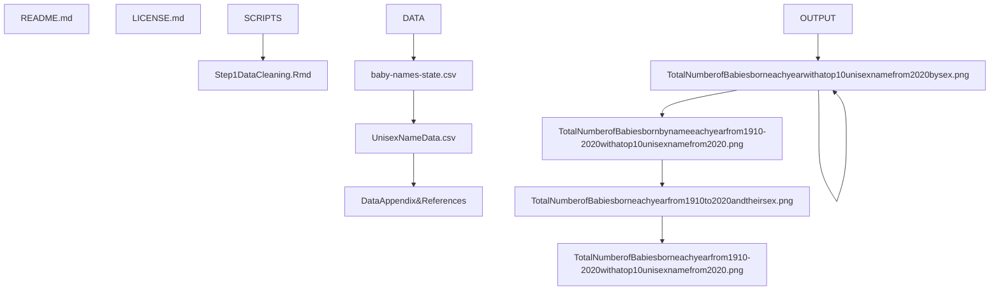

# DS4002-Project2

## Contents of Repository
This repository contains the code and documentation for conducting forecasting on unisex baby name trends. This repository contains a README file, LICENSE file, SCRIPTS folder, DATA folder, and OUTPUT folder. 

## *Section 1: Software and Platform Section* - CHANGE
- Software Used: RStudio (R)
- Packages Used: tidyverse, dplyr, PMCMRplus, readxl, plotly, wordcloud, tidytext, glue, stringr, tm, VADER from the nltk Python library
- Platform used: Mac

## Section 2: Map of Documentation *(EDIT)*

- Outline or tree of hierarchy of folders and subfolders and list the files stored in each folder

## Section 3: Instructions for Reproducing Results

GET THE DATA:
1. Download the "baby-names-state" csv file from Data World into your computer
2. *In R, upload the tidyverse, readxl, plotly, wordcloud, tidytext, glue, stringr, and tm packages*
3. *Read in the excel data file and save it as a data frame in R*

*CLEAN THE DATA:*
1. Rename the first column to "ReviewID" to differentiate it from "ClothingID"
2. Convert the "Division Name," "Departname," "Class Name," and "Recommended IND" columbs to factor data types
3. Remove the "Positive Feedback Count," "Rating," "Division Name," and "Class Name" columns from the data frame

*CREATE EXPLORATORY PLOTS FOR EDA:*
1. Use ggplot and plotly to create different bar plots that will help to visualize our data, where the Clothing Type is on the x-axis and different variables are on the y-axis for each graph:
  - Number of Reviews (y-axis) for Each Clothing Type (x-axis)
  - Distribution of Reviewer Ages (y-axis) for Each Clothing Type (x-axis)
  - Number of Recommendations (y-axis) for Each Clothing Type (x-axis)
  - Percentage of Recommendations (y-axis) for Each Clothing Type (x-axis)
2. Save these plots into the OUTPUT folder

*CREATE A WORD CLOUD PLOT:*
1. Read in the cleaned text data
2. Create a corpus using the Review Text column
3. Clean the Review Text column to prep for the word cloud
  - Convert the text to lower case
  - Remove special characters
  - Remove "stop" words (the, is, at on)
  - Use text stemming to turn each word into its root version
4. Transform the stripped data into a matrix
5. Use the word cloud function to create a cloud using the stripped text data matrix
6. Write above plot into a new csv file

*CONDUCT SENTIMENT ANALYSIS IN PYTHON:*
1. In Python, import the nltk and pandas libraries
2. Download VADER from nltk, then create an object of sentiment intensity analyzer
3. Read in the cleaned data as a data frame
4. Create a new column called scores using polarity scores function, then add that column into the existing data frame
5. Use the "lambda score_dict:score_dict['compound']" code found in VADER to create a new column called "compound" that will hold the sentiment scores for each review; add the new column into the existing data frame
7. Save the updated data set with new sentiment score columns as a csv file into your computer

*TEST ASSUMPTIONS FOR HYPOTHESIS TESTING:*
1. In R, read in the updated csv file containing the data set with the sentiment scores
2. Use the Department Name column (containing different clothing types) to create three separate data frames containing only bottoms, only tops, and only dresses
  - The dplyr package is useful when doing this
3. Pull out only the compound sentiment scores for bottoms, tops, and dresses separately into three different vectors
4. Create a new data frame with the compound sentiment scores in one column and the clothing type (whether the item is a top, dress, or bottom) in the other column
5. Apply the aov() ANOVA function on our data
6. Create a qqplot to check the normality assumption for ANOVA (points should follow the line of normality if our data is normal)
7. Use the Bartlett test to check for constant variance within our data (the p-value should be less than 0.05 if our data has constant variance)

*ASSUMPTIONS NOT MET --- TURN TO NON-PARAMETRIC HYPOTHESIS TESTING*
1. First construct boxplots to visually compare the compound sentiment scores for tops, pants, and dresses with each other (just to get an idea of what we are working with)
2. Conduct the Kruskal-Wallis Test on all three groups of clothing items

*KRUSKAL-WALLIS TEST SIGNIFICANT --- CONDUCT FOLLOW-UP PAIRWISE TESTING:*
1. Use the PMCMR package on our data to conduct Dunn's Test for follow-up pairwise testing
  - This test will compare every possible pairing between the three groups of clothing items to see if their compound sentiment scores are different across their medians

